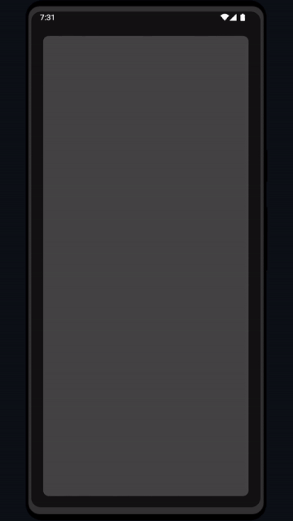

# Flashpad

A simple, clean flashlight app written in Kotlin

## Features

- Adjustable brightness control
- [Coming Soon] Custom Presets
- [Coming Soon] SOS Mode

## Installation

Check out the [releases](https://github.com/mattdangelo/flashpad/releases) page for pre-built APKs
