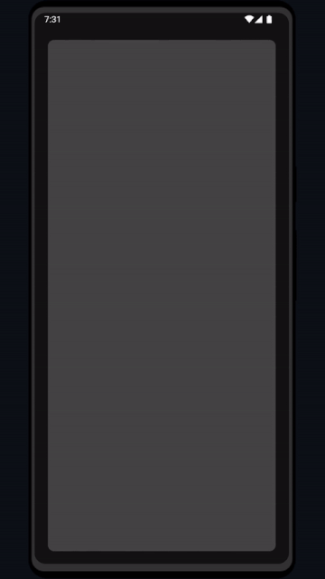

# Flashpad

A simple, minimal flashlight app written in Kotlin

[](https://choosealicense.com/licenses/mit/)
[]()




## About

Flashpad turns your phone's camera flash into a flashlight that you control with one finger. The whole screen is a large pad. Drag up and down on the pad to set the brightness of the torch: the higher you drag, the brighter it gets. When you let go, the torch turns off.

## Features

- Adjustable brightness: drag up and down on the pad to change the torch brightness. The pad colour also gets lighter as the torch gets brighter.
- SOS mode: tap the small "SOS" button in the top-left corner of the pad to flash the Morse code SOS pattern at the device's default torch brightness. The pad lights up with each flash. You can still use the pad while SOS is running, but the SOS flashes take precedence. Tap "SOS" again to stop.
- [Coming Soon] Custom Presets

## Requirements

- Android 13 (API level 33) or newer. Flashpad uses the torch strength control that was added in this version.
- A device with a rear camera flash. On devices without adjustable torch strength, the pad simply turns the torch on and off.

## Installation

Check out the [releases](https://github.com/mattdangelo/flashpad/releases) page for pre-built APKs.

## Building from source

The app is written in Kotlin and uses Jetpack Compose for the user interface. It is built with Gradle using the included Gradle wrapper (Gradle 9.8.0), so you do not need to install Gradle yourself. It targets API 36.

1. Clone the repository:

   ```
   git clone https://github.com/mattdangelo/flashpad.git
   ```

2. Open the project in Android Studio, or build from the command line:

   ```
   ./gradlew assembleDebug
   ```

   On Windows, use `gradlew.bat assembleDebug`.

3. Run the unit tests:

   ```
   ./gradlew testDebugUnitTest
   ```

## License

This project is licensed under the [MIT License](https://choosealicense.com/licenses/mit/).
